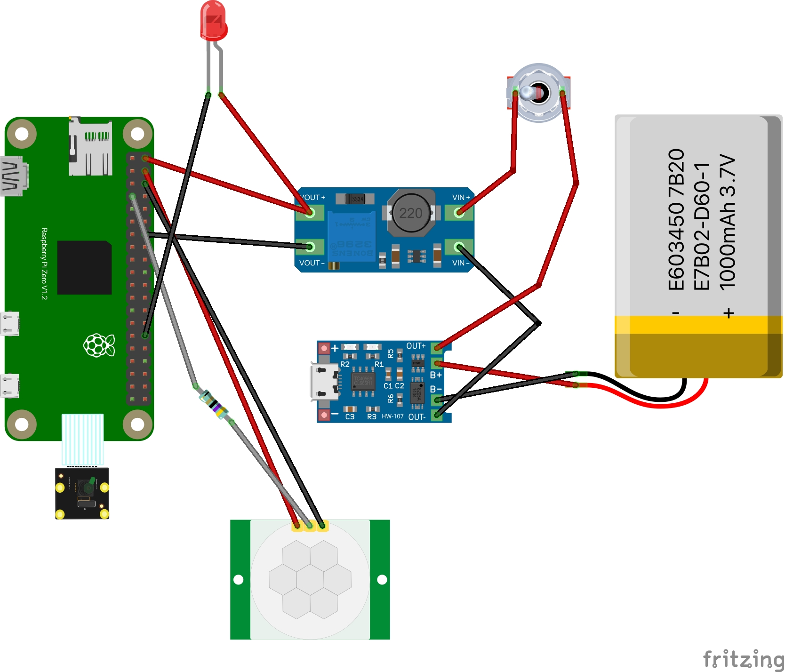

# Monan Live!

**Monan Live!** is a motion detector and image upload project. Using a Raspberry Pi Zero, we detect motion, take a picture, and upload it to a Drupal 9 website. 

Part List

- [Raspberry Pi Zero W](https://amzn.to/3dVpFX4)
- [Arducam 5MP Camera](https://amzn.to/3pZB1il)
- 
